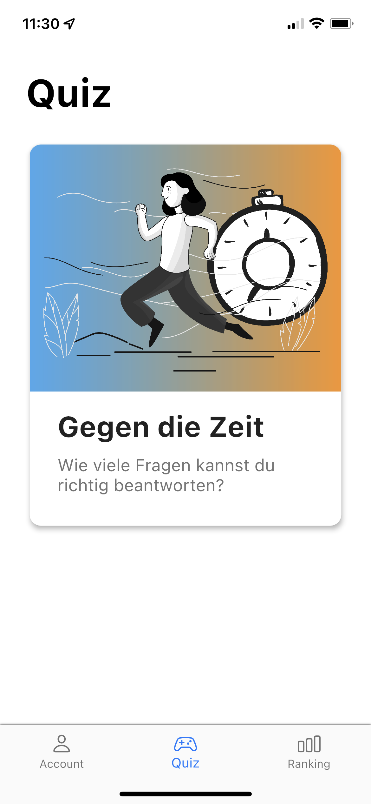
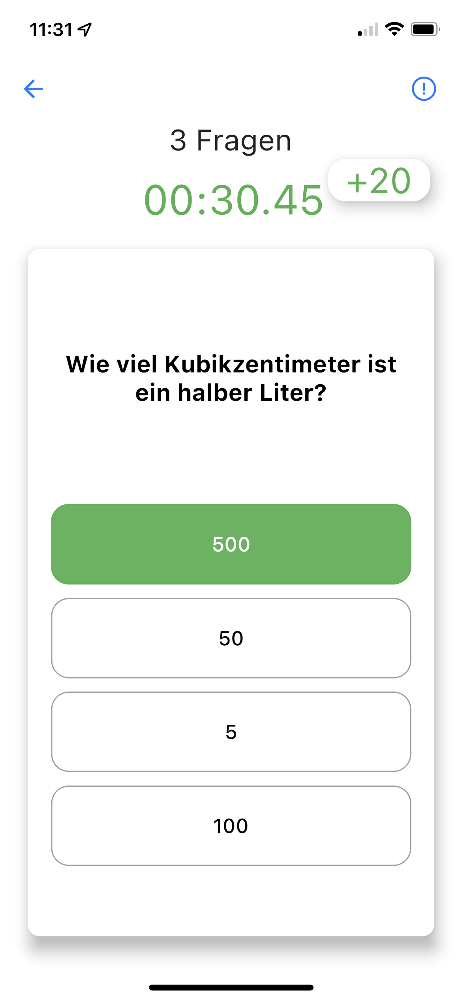
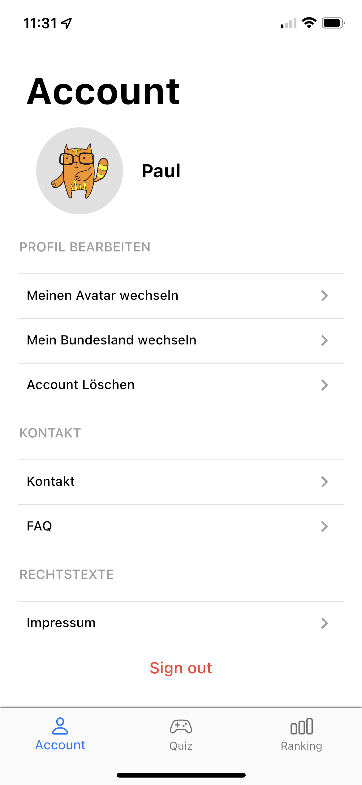
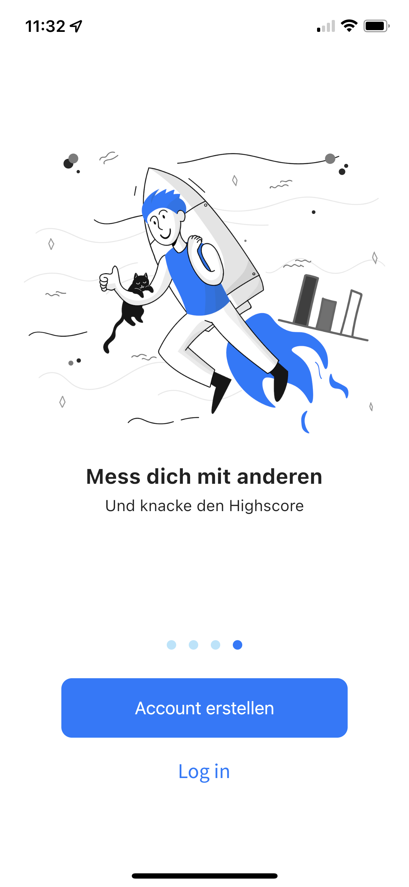

# 📱 Mobile Quiz App

&nbsp;&nbsp;&nbsp;&nbsp;&nbsp;&nbsp;&nbsp;&nbsp;&nbsp;&nbsp;&nbsp;&nbsp;

Welcome to the Mobile Quiz App repository! This mobile application is built using Flutter, allowing it to run on both iOS and Android devices seamlessly. The app makes use of Firestore database to store quiz questions, Firebase Authentication to securely authenticate users, and Firebase Crashlytics to monitor the app for crashes.

## Table of Contents
1. 📄 [Screens](#screens)
2. 🔥 [Firebase Integration](#firebase-integration)
3. 🚀 [Installation](#installation)
4. 📷 [Images](#images)
5. 📈 [Performance](#performance)
6. 🛡️ [Security](#security)
7. 📱 [Compatibility](#compatibility)

## Screens 📄
The Mobile Quiz App consists of the following three screens:

1. **User Screen**: This screen allows users to view their profiles and update their account settings. Users can view and manage their personal information and preferences from this screen.

2. **Game Screen**: The game screen is where users can launch a new quiz game. They can select a quiz category, set the difficulty level, and start answering questions.

3. **Ranking Screen**: On this screen, users can see how they compare against other users in terms of their quiz scores. The app displays a leaderboard showcasing the top-performing users.

## Firebase Integration 🔥
The app utilizes Firebase services to enhance its functionality:

1. **Firestore Database**: The Firestore database stores the quiz questions, including categories, questions, options, and correct answers. This allows users to access various quizzes and keeps the content up-to-date.

2. **Firebase Authentication**: Firebase Authentication provides a secure user authentication system. Users can create accounts, log in securely, and access personalized features.

3. **Firebase Crashlytics**: Firebase Crashlytics is integrated to monitor the app for crashes and exceptions. This helps the development team identify and fix issues to improve app stability.

## Installation 🚀
To run the Mobile Quiz App on your local machine, follow these steps:

1. Clone the repository:
   ```
   git clone https://github.com/your-username/Mobile-Quiz-App.git
   ```

2. Navigate to the project directory:
   ```
   cd Mobile-Quiz-App
   ```

3. Install dependencies using Flutter:
   ```
   flutter pub get
   ```

4. Setup Firebase Project:
   - Create a Firebase project at [firebase.google.com](https://firebase.google.com/).
   - Enable Firestore database, Authentication, and Crashlytics services.
   - Download the Firebase configuration file (google-services.json) and place it in the `android/app` directory.

5. Run the app on a connected device or emulator:
   ```
   flutter run
   ```

## Images 📷
Here are some screenshots of the Mobile Quiz App:

<div style="display:flex; flex-direction:row;">
    <div style="margin-right:10px;">
        
        <p style="text-align:center;">Game Selection Screen</p>
    </div>
    <div>
        
        <p style="text-align:center;">Quiz game screen Screen</p>
    </div>
</div>

<div style="display: flex; flex-direction: row;">
    <div>
        
        <p style="text-align:center;">User account Screen</p>
    </div>
    <div style="margin-left: 10px;">
        
        <p style="text-align:center;">Game introduction Screen</p>
    </div>
</div>

<div style="display: flex; flex-direction: row;">
    <div>
        
        <p style="text-align:center;">Onboarding Screen</p>
    </div>
</div>

## Performance 📈
The Mobile Quiz App is designed to be fast and responsive, providing users with a seamless experience. The app is optimized for performance, with efficient code and minimal resource usage. The app also makes use of caching and other techniques to reduce load times and improve performance.

## Security 🛡️
The Mobile Quiz App takes security seriously, with robust measures in place to protect user data and prevent unauthorized access. The app uses Firebase Authentication to securely authenticate users, and all user data is stored securely in the Firestore database. The app also makes use of encryption and other security techniques to protect sensitive data.

## Compatibility 📱
The Mobile Quiz App is designed to be compatible with a wide range of devices and operating systems. The app is built using Flutter, which allows it to run on both iOS and Android devices seamlessly. The app is also designed to be responsive, adapting to different screen sizes and orientations.